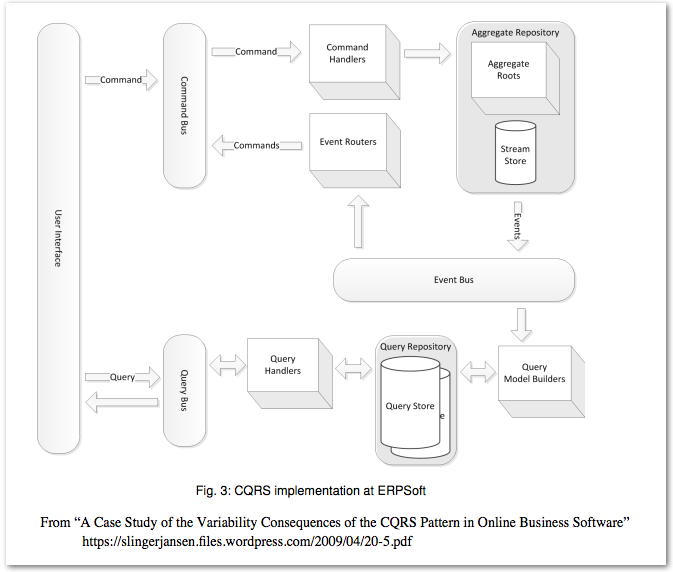

# CQRS Bank

CQRS is an architectural pattern that separates commands (which mutate state) from queries (which return values). 
With CQRS the “read” data store and the “write” data store can be on different severs, can use different storage 
engines, and can be scaled independently. CQRS is often linked with the Event Sourcing pattern which models state 
as a series of events (past tense verbs) rather than a single “latest” value. What works for an accountant’s ledger 
and for Git can work for our “write” store too. Given a series of events we can deal with concurrency and collisions 
more intelligently than “last guy wins”. We can also define varied service level agreements for commands and queries.

## Materials on CQRS

* Greg Young's "[CQRS, Task Based UIs, Event Sourcing agh!](http://codebetter.com/gregyoung/2010/02/16/cqrs-task-based-uis-event-sourcing-agh/)"
* Ben Smith's "Building a CQRS/ES web application in Elixir using Phoenix" ([blog](https://10cons
* Bryan Hunter's "CQRS with Erlang" ([code](https://github.com/bryanhunter/cqrs-with-erlang/tree/ndc-oslo)) ([video](https://vimeo.com/97318824))
ulting.com/2017/01/04/building-a-cqrs-web-application-in-elixir-using-phoenix/))
* "[A Case Study of the Variability Consequences of the CQRS
Pattern in Online Business Software](https://slingerjansen.files.wordpress.com/2009/04/20-5.pdf)" This whitepaper is the source of the excellent diagram below:

## The challlenge

* We are modeling a simple bank that has checking account customers. 
* We need to define a task-based UI to capture user intent and issue commands. 
* The data for our UIs will come from queries to read-side projections.
* Command handlers will receive a command and call the corresponding function on an aggregate.
* Aggregates are loaded and saved via a repository.
* The aggregate will contain the business logic to determine if a command will be processed or rejected.
* If a command is accepted an event will be emitted and applied (state change) to the aggregate.
* One or more event handlers will respond to an event and update read-side projections.
* The task-based UI will reload to show changes to the projections.

*Bonus: Event sourcing*
In typical CRUD application only the latest state of an aggregate is stored. With event sourcing, we store each individual 
event that was applied to the aggregate. With event sourcing load an aggregate by playing back the events that were 
previously applied to the aggregate. 

### Commands

* create_bank_account(accountId:int, accountHolder:string, pin:int) -> ack
* deposit_money_into_bank_account(accountId:int, amount:int) -> ack 
* withdraw_money_from_bank_account(accountId:int, amount:int, pin:int) -> ack

### Queries

* check_balance(accountId:int) -> int
* get_account_list() -> list<{accountId:int, accountHolder:string}> 
* get_total_deposits() -> int

### Events

* bank_account_created{accountId:int, accountHolder:string}
* money_deposited_into_bank_account{accountId:int, amount:int}
* money_withdrawn_from_bank_account{accountId:int, amount:int}
* invalid_pin{accountId:int, amount_requested:int}
* account_overdrawn{accountId:int, balance:int, amount_requested:int}

## Write your own

Join the fun! Add a directory to this repo containing your code.

If you don't already have the right permissions to push to this repo, file an issue! We'll hook you up.

By convention, we use directory names that tell who wrote the code and what language it's in, separated by a `+`. For example: `bryan_hunter+elixir`.

